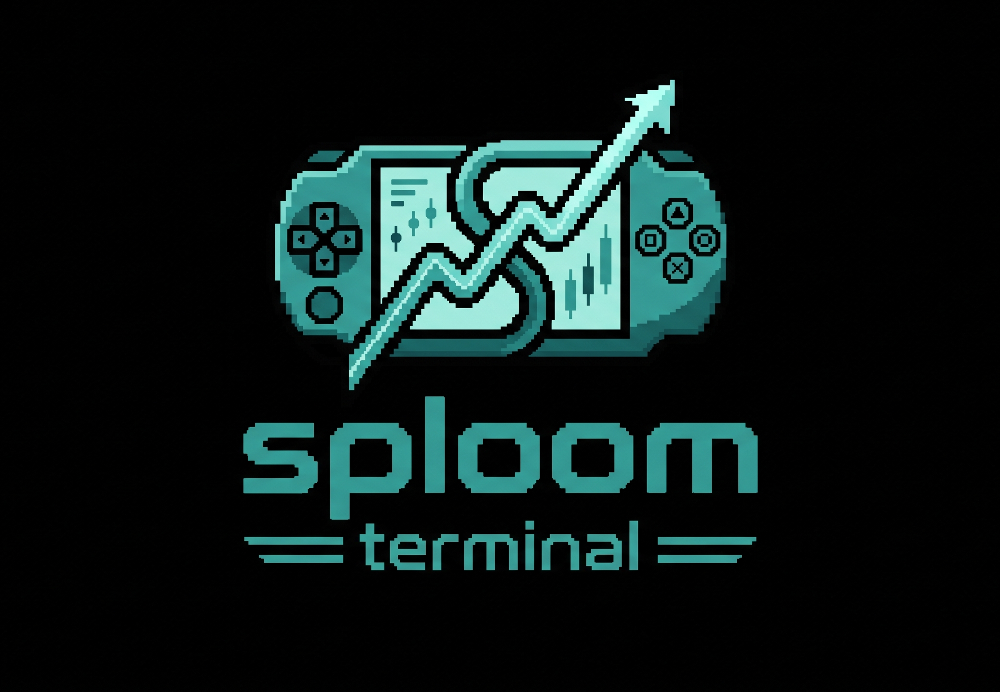

  

# 🚀 Sploom Terminal: PSP Trading Client

A quantitative trading and portfolio monitoring client built for the Sony PlayStation Portable (PSP). It uses a custom C-based frontend running on the console and a Python Flask backend to handle API requests, process data, and route live trades.

\---

## 🏛️ 1. System Architecture

The PSP has a strict 24MB RAM limit, which makes parsing large JSON payloads directly on the device unstable. To manage this, the system delegates the heavy lifting:

`\\\[PSP C Client] <--- HTTP/ASCII ---> \\\[Python Flask Server] <---> \\\[Alpaca / Finnhub / NewsAPI]`

* **Python Backend:** Hosted externally (e.g., AWS or PythonAnywhere). It fetches market data, calculates indicators, formats the text, and sends lightweight ASCII strings to the console.
* **C Frontend:** Handles the network requests, parses the ASCII data, processes D-pad inputs, and renders the text UI.

## ⚡ 2. Core Features

* **📈 Order Execution:** Users can input quantities via the D-pad and submit paper trades through the Alpaca API. The active orders blotter updates dynamically.
* **📰 News \& Sentiment:** The backend fetches articles from NewsAPI. Since the free tier truncates descriptions, the server uses a regex text-slicer to cleanly format the last readable sentence. VADER sentiment analysis is then applied to tag headlines as Bullish `\\\[+]`, Bearish `\\\[-]`, or Neutral `\\\[=]`.
* **📟 Terminal UI:** Built with `pspDebugScreen` to display account holdings and quantitative overlays (like Simple Moving Averages and Bollinger Bands) within a rigid 68-character width constraint.

## 🛠️ 3. Technical Notes \& Challenges

* **💾 Memory Management:** To prevent crashes from buffer overflows, string arrays in the C client are strictly capped (e.g., 512 bytes for news entries).
* **🌐 Network Parsing:** HTTP streams include carriage returns (`\\\\r\\\\n`) that break text rendering on the PSP. The C parser uses a custom `strtok\\\_r` implementation to clean these before displaying data.
* **🔗 Hardcoded Backend IP:** The C frontend currently relies on a hardcoded IP address/URL to connect to the Python backend. If you deploy this yourself, you must update the endpoint in your C source code before compiling.
* **🎨 Graphical Limitations:** `pspDebugScreen` does not support transparency. The UI uses a strictly dark, text-based layout to ensure high contrast and avoid rendering glitches.

## 📦 4. Required Repositories, APIs \& Services

This project relies on several legacy toolchains, modern APIs, and specific hardware configurations to function.

### Hardware / Custom Firmware

Your PSP must be running Custom Firmware (CFW). This is strictly required for two reasons: it allows the execution of unsigned homebrew code, and it is necessary to utilize modern WPA2 WiFi security protocols so the console can actually connect to a modern network router.

* 🔗 [ARK-4 CFW Repository](https://github.com/PSP-Archive/ARK-4) - *Highly recommended as the most stable environment for modern homebrew and networking.*

### Frontend Development Toolchain

Required to compile the `main.c` frontend for the legacy MIPS architecture.

* 🔗 [pspsdk (pspdev)](https://github.com/pspdev/pspsdk) - *The master toolchain for building PSP executables.*

### Financial APIs

Active API keys from these providers are required to populate the terminal data.

* 🔗 [Alpaca Markets](https://alpaca.markets/) - *Brokerage API used for live order routing and portfolio fetching.*
* 🔗 [Finnhub](https://finnhub.io/) - *Used for fetching fundamental company data (P/E, Market Cap, Beta).*
* 🔗 [NewsAPI](https://newsapi.org/) - *Used for querying real-time market headlines.*

### Backend Hosting \& Requirements (Python 3)

The middleware server requires a host capable of running Python web applications.

* 🔗 [PythonAnywhere](https://www.pythonanywhere.com/) or 🔗 [AWS EC2](https://aws.amazon.com/ec2/) - *Suggested hosting environments for the Flask app.*

Your `requirements.txt` file must include the following packages:

* `Flask==3.0.0`
* `requests==2.31.0`
* `vaderSentiment==3.3.2`
* `alpaca-trade-api==3.1.1`
* `pandas==2.1.4`

## ⚙️ 5. Setup Instructions

### Backend Setup

1. Navigate to the `/middleware\\\_server` directory and run `pip install -r requirements.txt`.
2. Open `app.py` and replace the placeholder API keys with your active credentials:

   * `ALPACA\\\_API\\\_KEY`
   * `ALPACA\\\_SECRET\\\_KEY`
   * `FINNHUB\\\_KEY`
   * `NEWSAPI\\\_KEY`
3. Run the Flask server on your hosting platform of choice.

### Frontend Compilation \& Installation

1. Ensure the `pspsdk` repository is cloned, installed, and added to your system `$PATH`.
2. Navigate to the `/psp\\\_client` directory on your computer.
3. Open `main.c` and update the hardcoded `ip\\\_bytes` (or `Host` header) to point to your live hosted Python backend.
4. Run `make clean` followed by `make` in your terminal to generate the `EBOOT.PBP` file.
5. Connect your PSP to your computer via USB.
6. Navigate to the `PSP/GAME/` directory on your memory stick.
7. Create a new folder inside `GAME` and name it `SploomTerminal`.
8. Drag and drop your compiled `EBOOT.PBP` (and the `ICON0.PNG` logo) into that new `SploomTerminal` folder.
9. Launch the terminal directly from the PSP XMB menu under Games.

\---

*Note: This software is configured to use the Alpaca Paper Trading API by default for testing purposes.*

